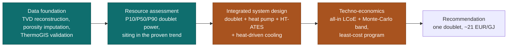

# Methodology

End-to-end workflow, from the provided well data to the recommended design. Teal denotes
Challenge 1 (resource), sienna denotes Challenge 2 (system and economics).

```mermaid
flowchart LR
    A["Data foundation<br/>TVD reconstruction, porosity imputation,<br/>ThermoGIS validation"]
    B["Resource assessment<br/>P10/P50/P90 doublet power,<br/>siting in the proven trend"]
    C["Integrated system design<br/>doublet + heat pump + HT-ATES<br/>+ heat-driven cooling"]
    D["Techno-economics<br/>all-in LCoE + Monte-Carlo band,<br/>least-cost program"]
    E["Recommendation<br/>one doublet, ~21 EUR/GJ"]
    A --> B --> C --> D --> E
    A:::ch1
    B:::ch1
    C:::ch2
    D:::ch2
    classDef ch1 fill:#0f6e6e,color:#ffffff,stroke:#0a4a4a;
    classDef ch2 fill:#a8531f,color:#ffffff,stroke:#7a3c16;
```
